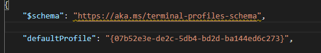

# Getting Started

This document should serve as a starting point for new people within the team
and includes some information on where to begin in setting up a laptop
with everything required to get started.

## The Cloud Ops Team

The Cloud Ops Team overall are responsible for all of our cloud infrastructure,
however our team specifically is responsible for the AWS Infrastructure and the
IMA Platform (Infrastructure Monitoring and Alerting).

## Accounts Required

### AWS
An AWS Account is required to manage our infrastructure in AWS. This will need
to be set up by someone on the team who is already set up in AWS.

### GitHub
A GitHub account is required to contribute to our GitHub repos. This should be
a personal account and will be invited to the MoJ Organisation. If you do not
already have one you can create one at [github.com](https://github.com/).

### Google
We use Google Meets for many of our meetings and therefore a Google account is
required. This can be set up using an @justice.gov.uk email address by visiting
the [Google account signup page](https://accounts.google.com/signup) and
specifying the *Use my current email address* option.

### LastPass
We use LastPass for storing credentials. Access to this will be arranged by someone
on the team.

### SSH Key
An SSH Key is required to authenticate your GitHub account and interact with the MoJ
repos. A guide on setting up an SSH key on your GitHub account can be found [here](https://help.github.com/en/articles/adding-a-new-ssh-key-to-your-github-account)

## Software Required

Any software you are comfortable with can be used if necessary, though here is
a list of what is recommended and typically used by the team.

WSL2 - We use Ubuntu running on WSL 2. A guide to installing & configuring WSL 2 can be found [here](https://docs.microsoft.com/en-us/windows/wsl/install-win10#manual-installation-steps).

Windows Terminal - This can be installed from the Microsoft Store. To set it up so
that it launches directly into Ubuntu, just go into settings and set "defaultProfile:"
at the top with the value being the guid that corresponds with your Ubuntu installation;
this can be found further down in the settings file under the profiles section.

[Visual Studio Code](https://code.visualstudio.com/download)

[Docker Desktop](https://www.docker.com/products/docker-desktop) - Required for running docker containers locally.

[Git](https://git-scm.com/) (Git for Windows is also a suitable alternative.)

[jq](https://stedolan.github.io/jq/) - This is used for parsing JSON and can be
installed in Ubuntu by running `sudo apt-get install jq`.

[Make](https://www.gnu.org/software/make/) - We use Make for running scripts. This can be installed by running `sudo apt install make`.

[Slack](https://slack.com/intl/en-gb/downloads/windows) - This can either be
installed by downloading the installer from the Slack website or via the Microsoft
Store.

There are several other tools required for interacting with Terraform and AWS.
These are detailed [here](https://github.com/ministryofjustice/staff-infrastructure-monitoring#getting-started)
along with more information on how to configure them.

## How We Work

We take an Agile approach to work, working in 2 week sprints and having daily standups
as well as other elements typical of this style of working and the structures
required to support it such as sprint planning/retrospectives, backlog refinement, show
& tell style demos, and regular one to one meetings. We will regularly pair on
technical tasks and we use GitHub for versioning our code and to allow for code review
on changes being implemented.

## Other Stuff

JIRA - Our JIRA Board can be found [here](https://dsdmoj.atlassian.net/secure/RapidBoard.jspa?rapidView=432&quickFilter=1066).